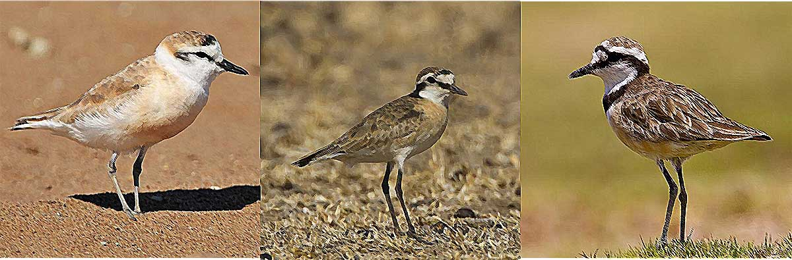

```{r setup, include=FALSE}
knitr::opts_chunk$set(tidy = TRUE,cache=FALSE,warning = FALSE,
                      comment = "#>",fig.width = 9,fig.height = 6,fig.align = "center",
                      dpi = 72)
```

## Intro

This is R Markdown document provides all code necessary code to run the analysis on chemical profiles of preen gland samples of three Madagascan plover species (Kittlitz´s-, Madagascar- and White-fronted). Samples have been processed by gas-chromatography and peaks were called using **Xcalibur 2.0.5**. All further steps are reproducible with the code delivered within this document. The Document is under development and will be updated while running the analysis!

## Bullet points
* Possibility to compare scent profiles of the preen gland with the body swabs: Mantel Test to test for correlations in the similarity/ dissimilarity among individuals based on both scent profiles.
* Comparison of odour diverstiy between both data sets

```{r,fig.align='center',echo=FALSE}

```

## Getting started: Load the data and packages to the Global Environment

### Prerequisites

For reproducing the presented code completely, you will need to install **GCalignR** first.
The package can be downloaded in the most recent development version from GitHub:
```{r, eval = FALSE} 
install.packages("devtools") devtools::install_github("mastoffel/GCalignR",
build_vignettes = TRUE) 
```

```{} 
library(GCalignR) # does the alignment of gc-data, already run before
```

### Load the raw data
The raw data was already transformed into the working format of GCalignR. In the data set there are six blanks (i.e. controls only filled with dichlormethane, the solvent used) and an additional sample ("w41") containing a septum, that was detached from one of the samples ("w65") was included to control for potential influences of dislodged septums on the chemical profiles. Since a high number of peaks (n=129) was called, the suitability to act as a control seems very limited, hence we will exclude this sample now.

```{r,eval=FALSE}
load("data/charadrius_peaks.RData")
charadrius_peaks[["w41"]] <- NULL # remove w41
```

Lets do the alignment of the gas-chromatography peaks. We use the chromatogram with the highest peak count to apply linear transformations of peak retention times in order to control for systematic temporal shifts in the gas-chromatography run. 

```{r,eval=FALSE}
charadrius_peaks_aligned <- align_chromatograms(data =charadrius_peaks ,
            rt_col_name = "rt", # retention time
            conc_col_name = "area", # peak abundance
            reference = "w62", # sample with the most peaks 
            write_output = c("rt","area"), 
            blanks = c("w17","w37","w47","w57","w67","w77"),
            delete_single_peak = T, # peaks present in one sample are not informative
            min_diff_peak2peak = 0.03,
            max_diff_peak2mean = 0.03,
            rt_cutoff_low = 8 # peaks before the solvent are treated as uncertain
                                   )
save(charadrius_peaks_aligned,file = "data/charadrius_peaks_aligned.RData")
````

## Extract the scent data and load covariates

The lines of code above have been already executed, so we can load the data now. Some tweaking is done to format the data for a easy usage in the following analytical steps. 

```{r,eval=TRUE} 
load("data/charadrius_peaks_aligned.RData") # GCalignR output
# normalise the peak abundancies
scent <- GCalignR::norm_peaks(charadrius_peaks_aligned,conc_col_name = "area",rt_col_name = "rt",out = "data.frame")  
scent <- log(scent + 1) # log+1 transformation to reduce mean-variance trends
factors <- read.csv("data/factors.csv",sep = ";",skip = 1) # Comprises all available covariates
factors$pair <- paste0(factors$Species,factors$Nest_Brood) # unique "pairs"
factors$pair[is.na(factors$Nest_Brood)] <- NA # Drop unknown Individuals from "pairs"
row.names(factors) <- as.character(tolower(factors$GC_Sample)) # for cross-reference with gc-data
scent <- scent[match(row.names(factors),row.names(scent)),] # same order of rows is crucial 
# The data includes duplicates for three plover individuals
indices <- which(factors$Ring %in% factors$Ring[duplicated(factors$Ring)]) # duplicated Individuals
```
```{r,results="asis"}
pander::pandoc.table(factors[indices,c(2:7,9,12,17,18,19)])
``` 

Since one MP (FH47040) was sampled twice during brooding, we average the two samples, thereby we avoid pseudo-replication. 

```{r}
samples <- which(factors$Ring=="FH47040") # corresponding sample rows
scent[samples[1],] <- unlist(lapply(1:ncol(scent),function(x){ # average the samples
if(any(scent[samples,x]>0)) {
scent[samples[1],x] <- mean(scent[samples,x][scent[samples,x]>0]) # do not average zeros
} else{
scent[samples[1],x] <- 0
}
}))
scent <- scent[-samples[2],] # remove the second sample 
factors <- factors[-samples[2],]
```


## Now we can start to analyse patterns using  Nonmetric multidimensional scaling (NMDS)

At first we want to load the package **vegan** which provides some useful functionalities

```{r,results="hide"} 
library(vegan) # for metaMDS, adonis, betadisper and simper 
source("R/nmds_calculator.R") # nmds scaling formatting for plotting using vegan::metaMDS 
library(ggplot2) 
source("R/nmds_plotter.R") # little function for plotting using ggplot2 
```

Now we can start to do some nmds plots
```{r,eval=TRUE} 
# We use vegan::metaMDS specifying a bray-curtis dissimilarity matrix and subset the data set a bit
m1 <- nmds_calculator(scent = scent,factors = factors,sub = list(Age ="A")) # we focus on adults for now
nmds_m1 <- m1$nmds # nmds-coordinates + factors
scent_m1 <- m1$scent # scent matrix, subsetted
factors_m1 <- m1$factors # factors, subsetted 
nmds_plotter(nmds = nmds_m1,main = "Plover Preen Profiles\nat all parental care stages") # plot the results
```

```{r}
beta1 <- vegan::betadisper(vegan::vegdist(scent_m1,method = "bray"), factors_m1$Species) 
anova(beta1) # There is a dispersion effect, i.e. variance is not equal among Species
TukeyHSD(beta1) # post-hoc test
```

```{r}
vegan::adonis(scent_m1 ~ factors_m1$Brood_Status*factors_m1$Species)
```